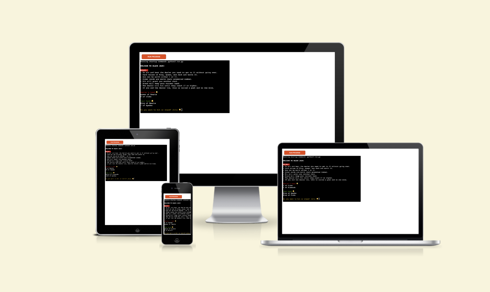
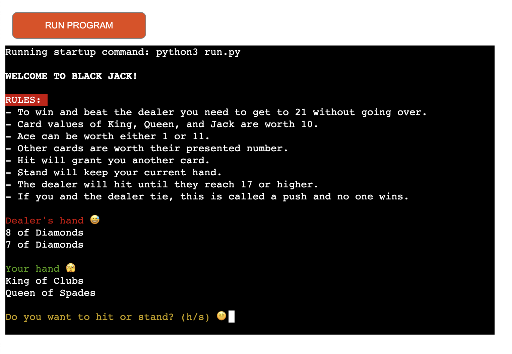
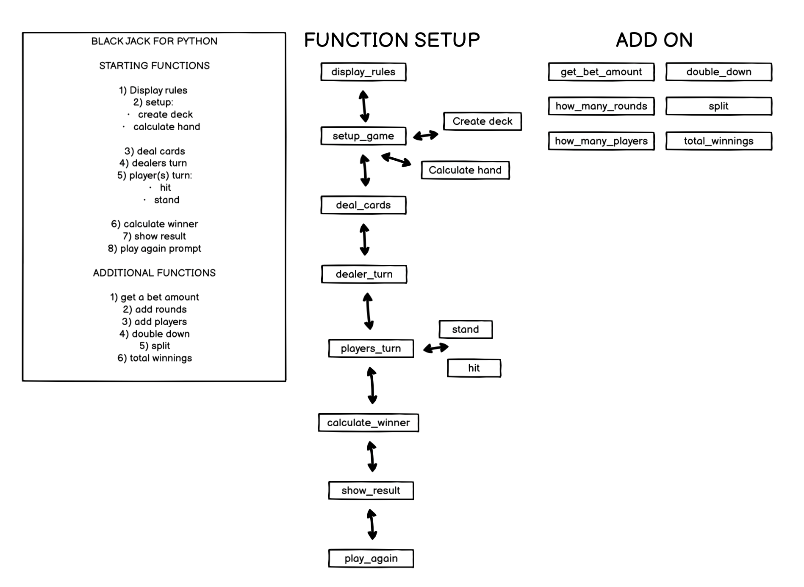

# BLACK JACK: LEVEL 1

This is the classic and highly popular casino black jack game but stripped down to its basic functions hence the name, "Black Jack: Level 1". It excludes the premise of betting and simply allows the player to hit or stand in order to beat the dealer.

**ACCESS GAME**

- https://black-jack-lvl1-25fdd631e5ae.herokuapp.com/

## HOW TO PLAY

How to play is set out in the rules:

Following the guidelines set out by, "https://www.blackjackapprenticeship.com/how-to-play-blackjack/" with a few omissions of:

- Wagering
- Betting
- Doubling Down
- Splitting

## USER STORIES

- As a user, I want to play an easy to access interactive game
- As a user, I want a game to tell me how to play it clearly
- As a user, I want a game to handle my inputs correctly and ensure smooth flow throughout
- As a user, I want the option to play again when the game has drawn to a natural end
- As a user, I want a game where I can practice the fundamentals of black jack

## FEATURES

The features follow this balsamiq flowchart:

### EXISTING FEATURES

The existing features are as follows:

#### Random deck creation:

- A new shuffled deck is created upon every round

#### Play against computer:

- You play against the dealer who hits until its hand reaches 17

#### Accepts user input:

- Opting to hit or stand
- Opting to play again

#### Maintains value of cards dealt:

- The game knows the total value of the cards that it uses when determining the winner

#### Input validation and error handling:

- The game ensures you have entered the correct values when hitting (h) or standing (s)
- The games does the same for play again values with (y) and (n)

### FUTURE FEATURES

Future features will ensure that the Black Jack game is played at its casino level that includes all of the standard features you would expect to see when playing at a casino in Las Vegas:

- Wagering
- Betting
- Doubling Down
- Splitting
- Choosing amount of rounds
- How many players
- Total winnings and loses

## TESTING

### BUGS

#### SOLVED BUGS

##### Returning "BUSTED" as a string in the players turn:

Caused a type error because it changed the expected return type of the function. The code expected the players_turn to return a list of cards (the player's hand) rather than string.

##### When busted and player plays again - hands are not displayed:

This was due to the fact that return player's hand was missing, as this ensures hands are displayed.

### REMAINING BUGS

No remaining bugs other than:

- Emojis are clipped on safari and firefox

### VALIDATOR TESTING

I installed FLAKE8 which adheres to pep8 standards which states: "no problems".

#### Code Institute Pylinter:

Code institutes python linter also shows the all clear

### INPUT TESTING

For this project there are 2 inputs. 1 for hitting or standing and the 2nd is for playing again. Below are screenshots of these inputs being tested for; a letter, multiple letters, a number, multiple numbers, empty enter, spaces, and special characters:

#### HIT OR STAND INPUT:

As you can see below the inputs work correctly and reminds user to input 'h' for hit and 's' for stand.

#### PLAY AGAIN INPUT:

As you can see below the inputs work correctly and reminds user to input 'y' for yes and 'n' for no.

### DEPLOYMENT

This project was deployed using code institutes python template from github for gitpod and then onto Heroku.

#### Local deployment:

- Copy code from github
- paste into your chosen IDE
- Make sure python is downloaded
- Save it into your IDE
- In terminal run the code i.e., python run.py

#### Steps for deployment:

1. **Fork/clone the repository**: From my github https://github.com/Ojay97-hub/black-jack-game
2. **Create a New Heroku App** - Go to heroku and create new app by clicking 'New'. Enter app name and your region.
3. **Set Buildpacks**: In the config vars set buildbacks in order of Python and NodeJS in that order
4. **Configure the Port**: Enter PORT as a key with a value of 8000
5. **Link to GitHub**: Set github as the deployment method and click 'connect' to link Heroku app to github repository
6. **Deploy the Application**: Click on deploy by choosing the main branch and click 'deploy branch'. Once it has downloaded click 'open app' to access the app page

### CREDITS

- [Code Institute](https://codeinstitute.net) for providing the Python template.
- [Blackjack Apprenticeship](https://www.blackjackapprenticeship.com/how-to-play-blackjack/) for the comprehensive gameplay guidelines.
- [Beau Carnes' video tutorial](https://youtu.be/aryte85bt_M?si=sazubDrzIn9JQyaX) and [source code](https://replit.com/@BeauCarnes/blackjack-python#main.py) for guidance.
- [FreeCodeCamp](https://www.freecodecamp.org/news/python-switch-statement-switch-case-example/) for the match case refactor guidance.
