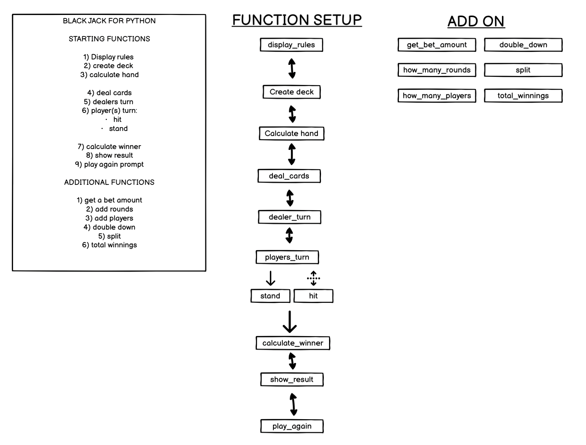

# BLACK JACK: LEVEL 1

## HOW TO PLAY

How to play is set out in the rules:

Following the guidelines set out by, "https://www.blackjackapprenticeship.com/how-to-play-blackjack/" with a few omissions of:

- Wagering
- Betting
- Doubling Down
- Splitting

## FEATURES

The features follow this balsamiq flowchart:

### EXISTING FEATURES

### FUTURE FEATURES

## SPECIFIC CODE USED

## TESTING

### BUGS

#### SOLVED BUGS

- Returning "BUSTED" as a string in the players turn:
  Caused a type error because it changed the expected return type of the function. The code expected the players_turn to return a list of cards (the player's hand) rather than string.

- When busted and player plays again - hands are not displayed:
  This was due to the fact that "return player's hand" was missing, as this ensures hands are displayed.

### REMAINING BUGS

- No remaining bugs

### VALIDATOR TESTING

I installed FLAKE8 which is adheres to pep8 stands which states: "no problems"

### DEPLOYMENT

This project was deployed using code institutes python template for gitpod and then onto Heroku.

#### Steps for deployment:

- Fork/clone the repository from my github: https://github.com/Ojay97-hub/black-jack-game
- Go to heroku and create new app
- Set buildbacks in order of Python and NodeJS
- Link Heroku app to github repository
- Click on deploy

### CREDITS

- Code institute for the python template
- https://www.blackjackapprenticeship.com/how-to-play-blackjack/
